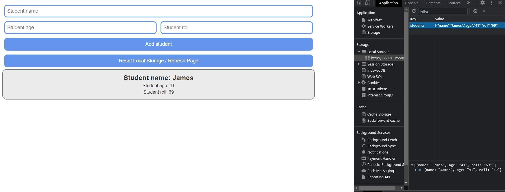

# local-storage-practice
This is NOT my project. I am only following along with Max Programming's YouTube channel for the practice.

I added a local storage clear / page reload button in addition to his video.

The tutorial video is found here: ***https://www.youtube.com/watch?v=U693xrQKFy4***

# Credits
***Max Programming*** @ ***https://www.youtube.com/@MaxProgramming***